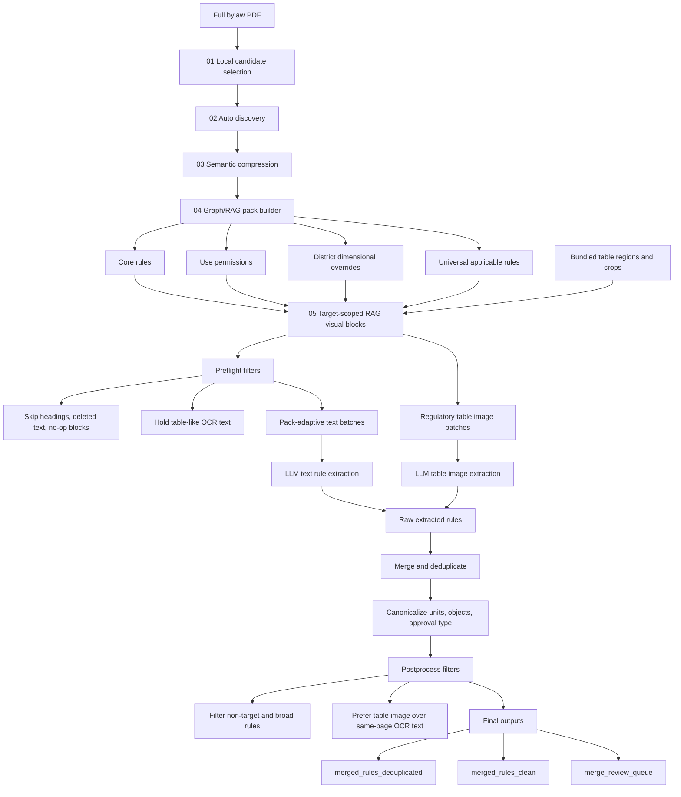

# Additional Experiment: Pipeline 11

`code/experiment_pipeline_11_bge_m3` is an additional experiment, not the official
extraction pipeline. The official extraction pipeline for this branch is
`code/official_rule_extraction_pipeline`.

Pipeline 11 tests a hybrid retrieval/compression version of Pipeline 10. It
keeps Pipeline 10's generalized graph/RAG and batched extraction path, then adds
local `bge-m3` embeddings as a conservative semantic signal.

1. hybrid lexical + local `bge-m3` semantic compression before extraction;
2. graph/RAG evidence packs grouped by rule role;
3. target-scoped adapter with continuation-aware trimming;
4. inherited table crops from bundled visual-block resources;
5. batched LLM extraction with cache, retry, and partial rerun support;
6. postprocess filters that separate clean GIS-ready rules from review items.

The default run is offline and stops before API extraction. Treat Pipeline 11
outputs as experimental until they are manually compared against Pipeline 10 and
approved for promotion.

To avoid duplicating large artifacts, this experiment reuses the official
pipeline's bundled PDFs and visual-block resources when local copies are absent.

The important design choice is that embeddings are additive. Pipeline 11 does
not replace lexical/structural filters with vector search. It computes:

```text
compression_score =
  0.45 * structural_score
+ 0.30 * lexical_score
+ 0.15 * bge_m3_embedding_score
+ lane_bonus
```

Hard keeps and hard drops still come from target terms, rule signals, graph
closure, and noise filters. Embedding mainly rescues/reranks borderline blocks.

## Self-Contained Layout

Pipeline 11 is intended to run without importing code from older prototype
folders. The required runtime pieces now live under this directory:

```text
local_candidate_block_selector.py      # local PDF block recall
visual_blocks_rule_extractor.py        # Gemini calls, prompts, merge helpers
pdfs/<city>/                           # default source PDFs by city
resources/visual_blocks/<city>/        # bundled table_regions/table_images
outputs/<city>/...                     # generated pipeline outputs
```

`resources/visual_blocks/<city>/` is used only to inherit table crops into the
RAG visual-block adapter. A caller can still override it with
`--source-visual-blocks-dir`.

## Flow



## What Changed From Pipeline 10

Pipeline 10 already had an optional Ollama embedding mode, but that mode could
replace lexical similarity. Pipeline 11 makes the safer path the default:

```text
Pipeline 10:
structural + lexical compression
or embedding-only Ollama compression

Pipeline 11:
structural + lexical + bge-m3 hybrid compression
          -> graph/RAG packs
          -> inherited table crops
          -> batched text/table extraction
          -> merge/dedup/canonicalize/postprocess
```

Important current behaviors:

- Default `--compression-provider hybrid` uses local Ollama `bge-m3`.
- Embeddings are cached in `03_semantic_compression/ollama_embedding_cache_bge-m3.json`.
- Embeddings are requested through Ollama's batch endpoint when available, with
  single-text fallback.
- `pack_adaptive` batching keeps dense packs isolated and groups smaller
  low-risk packs.
- Cached `api_raw/*_parsed.json` files are reused unless `--overwrite` is
  passed.
- `--only-batches` can rerun selected text batches while preserving previously
  cached text/table rules.
- Target trimming keeps governing clauses before target list items and keeps
  child list items after `that:` or `where:` clauses.
- When Burnaby table-image extraction succeeds, same-page OCR table text is
  filtered out of final results to avoid duplicate and weaker table rules.
- Rules with incomplete evidence, source warnings, or unit/object conflicts stay
  in `merge_review_queue.*`; complete rules with exceptions can still enter the
  clean output.

## Run Offline

From the repo root:

```powershell
python code\experiment_pipeline_11_bge_m3\pipeline11_runner.py vancouver
python code\experiment_pipeline_11_bge_m3\pipeline11_runner.py burnaby
python code\experiment_pipeline_11_bge_m3\pipeline11_runner.py calgary
```

Build extraction batches without calling the API:

```powershell
python code\experiment_pipeline_11_bge_m3\pipeline11_runner.py vancouver --dry-run-extraction
python code\experiment_pipeline_11_bge_m3\pipeline11_runner.py burnaby --dry-run-extraction
python code\experiment_pipeline_11_bge_m3\pipeline11_runner.py calgary --dry-run-extraction
```

Useful offline controls:

```powershell
--compression-provider hybrid --ollama-model bge-m3
--compression-provider lexical
--compression-provider ollama --ollama-model bge-m3
--embedding-batch-size 16
--compression-threshold 0.32
--pack-threshold 0.28
--max-windows 100
```

## Run Extraction

Set `GEMINI_API_KEY`, then run a full extraction:

```powershell
python code\experiment_pipeline_11_bge_m3\pipeline11_runner.py burnaby --run-extraction --model gemini-2.5-flash --text-model gemini-2.5-flash --table-model gemini-3.1-pro-preview --max-workers 1
python code\experiment_pipeline_11_bge_m3\pipeline11_runner.py calgary --run-extraction --model gemini-2.5-flash --text-model gemini-2.5-flash --table-model gemini-3.1-pro-preview --max-workers 1
```

Useful extraction controls:

```powershell
--max-blocks-per-batch 8
--max-chars-per-batch 12000
--call-delay-seconds 1
--max-retries 3
--retry-base-seconds 20
```

Rerun only selected text batches after adapter or prompt changes:

```powershell
python code\experiment_pipeline_11_bge_m3\batched_rag_rule_extractor.py --visual-blocks-dir code\experiment_pipeline_11_bge_m3\outputs\calgary\05_rag_visual_blocks --output-dir code\experiment_pipeline_11_bge_m3\outputs\calgary\06_rule_extraction_hq --model gemini-2.5-flash --text-model gemini-2.5-flash --table-model gemini-3.1-pro-preview --only-batches text_batch_0006 text_batch_0025 --overwrite --target-terms "backyard suite" "backyard suites" "secondary suite" "secondary suites"
```

Rebuild final outputs from cached raw rules without API calls:

```powershell
python code\experiment_pipeline_11_bge_m3\rebuild_outputs_local_dedup.py code\experiment_pipeline_11_bge_m3\outputs\burnaby\06_rule_extraction_hq --target-terms "small-scale multi-unit housing" "small scale multi unit housing" "rowhouse dwellings" "rowhouse dwelling" "rowhouse"
python code\experiment_pipeline_11_bge_m3\rebuild_outputs_local_dedup.py code\experiment_pipeline_11_bge_m3\outputs\calgary\06_rule_extraction_hq --target-terms "backyard suite" "backyard suites" "secondary suite" "secondary suites"
```

## Outputs

High-quality extraction outputs live under:

```text
outputs/<city>/06_rule_extraction_hq/
```

Use these files by default:

```text
merged_rules_clean.json
merged_rules_clean.csv
```

These contain the clean, postprocessed rule set intended for downstream GIS
classification and rule modeling.

Supporting outputs:

```text
merged_rules_deduplicated.json/csv  # full deduplicated set after filters
merge_review_queue.json/csv         # incomplete/conflicted rules for review
postprocess_filter_audit.json/csv   # rules filtered out and why
combined_rules_raw.json/csv         # raw text + table rules before merge
text_rules_raw.json/csv             # raw text-batch rules
table_rules_raw.json/csv            # raw table-image rules
api_raw/                            # cached prompts, parsed JSON, API responses
```

Pipeline 10 baseline HQ summaries before Pipeline 11 hybrid reruns:

```text
Burnaby: dedup=60, clean=60, review=0
Calgary: dedup=145, clean=137, review=8
Vancouver: dedup=47, clean=39, review=8
```

## Quality Checks

Compare Pipeline 11 against a baseline:

```powershell
python code\experiment_pipeline_11_bge_m3\compare_batched_quality.py
```

Manual quality checks should focus on:

- source coverage against PDF pages;
- table-image rules versus table OCR duplicates;
- target relevance for the requested building/use type;
- review queue reasons, especially incomplete `where:` / `that:` evidence;
- canonical `rule_object`, `operator`, `value`, and `unit` fields.

The clean output is not a legal interpretation. It is a structured extraction
artifact for downstream GIS and rule-classification work.
