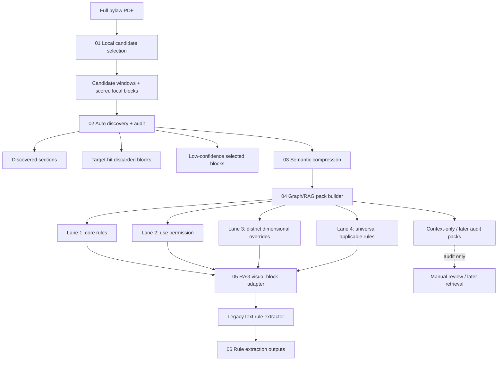

# Prototype Pipeline 9

Pipeline 9 is the graph/RAG version of the rule extraction path. It keeps
Pipeline 6's deterministic local recall, adds an automatic discovery/audit
stage, adds an offline semantic/lexical compression pass, then replaces
page-level text extraction with compact rule evidence packs.

The default runner is offline. It builds candidate blocks and RAG packs, then
stops before any LLM call unless `--run-extraction` is passed.

## Flow



## What Changed From Pipeline 8

Pipeline 8 still follows a page route:

```text
local selection -> optional window refinement -> visual blocks -> rule extraction
```

Pipeline 9 follows a block/pack route:

```text
local selection -> auto discovery/audit -> semantic compression -> graph/RAG pack selection -> lane split -> legacy extractor adapter
```

The important difference is that extraction no longer needs every selected page
as one large text batch. Instead, the graph builder chooses rule-bearing blocks,
adds conservative context, and emits small evidence packs.

## Auto Discovery

`02_auto_discovery` is the step that keeps the builder from becoming a pile of
city-specific section names. It does not require hand-written include/exclude
sections. Instead, it reads `local_blocks_scored.jsonl` and
`candidate_windows.jsonl`, then emits:

```text
discovered_blocks.jsonl
discovered_sections.json
target_hit_discarded.jsonl
rule_signal_discarded.jsonl
low_confidence_selected.jsonl
cross_references.jsonl
noise_report.json
summary.json
```

Every discovered block carries:

```json
{
  "selected_because": ["target_term_hit", "rule_signal", "same_section_as_target"],
  "rule_types": ["dimensional_standard"],
  "discovery_confidence": 0.85,
  "selection_tier": "core",
  "must_keep": true,
  "drop_risk": "low"
}
```

This moves manual checking from "read the whole PDF and write section rules" to
"review suspicious discovery outputs".

`selection_tier` separates selected blocks into `core`, `support`, and
`weak_context`. The graph/RAG pack builder keeps direct target/candidate/list
continuation hits, then uses `--pack-threshold` to prevent high-risk weak
context from entering the first-pass extractor.

## Current Scope

Pipeline 9 has one runner and one generic pack-building path for the tested
cities:

```powershell
python code\prototype_pipeline_9\pipeline9_runner.py burnaby
python code\prototype_pipeline_9\pipeline9_runner.py vancouver
python code\prototype_pipeline_9\pipeline9_runner.py calgary
```

The stages are the same for all three cities:

```text
01_local_selection -> 02_auto_discovery -> 03_semantic_compression -> 04_graph_rag_packs -> 05_rag_visual_blocks
```

All three cities use `generic_discovery_pack_builder.py`. The old
Calgary-specific builder is kept only as an experiment/reference while the main
pipeline is generalized.

## Key Selection Techniques

- **Target and rule signals**: keep blocks with target terms, numeric zoning
  measurements, modal verbs, or regulatory phrases.
- **District use sweep**: scan Calgary district use tables for Backyard Suite
  and Secondary Suite eligibility, including district headers and immediate
  continuations.
- **Applicable-rule sweep**: add indirect suite rules, such as parking,
  dimensional overrides, floodway/permit/notice rules, and other rules that
  apply through district or general sections.
- **List continuation closure**: shared helper that adds sibling list items after
  an explicit rule intro. This catches blocks like `(a)`, `(b)`, `(i)` whose
  governing verb lives in the parent clause.
- **Semantic compression**: score discovered blocks with offline lexical
  similarity by default, or optional local Ollama embeddings, before packs are
  built.
- **Weak-context pack threshold**: always keep direct target/candidate/list
  continuation hits, but require weak same-page/same-section context to clear
  `--pack-threshold`.
- **Target-aware adapter**: before calling the legacy extractor, mixed use lists
  are trimmed to target-bearing items and unrelated named uses are dropped.
  Broad context stays in RAG/audit unless `--include-broad-context` is used.
- **Upper-level applicability**: keep rules whose scope clearly includes the
  target even without naming it, such as `all dwelling units`, `all residential
  buildings`, `all parcels`, or `all uses in this district`. Rules phrased as
  `developments/buildings/parcels containing ...` are kept only when the
  contained object names the configured target terms, so rules for other
  building types do not leak back into extraction.
- **Lane split**: extract lanes 1-4 first; keep definitions and broader context
  for audit or later retrieval.

## Files

```text
prototype_pipeline_9/
  pipeline9_runner.py               end-to-end offline runner, optional LLM extraction
  auto_discovery.py                  automatic section/block discovery + audit files
  semantic_compression.py           lexical or local-Ollama block compression
  generic_discovery_pack_builder.py  city-neutral packs from auto discovery
  calgary_graph_rag_builder.py       archived Calgary-specific experiment/reference
  graph_rag_selection.py             shared list-continuation closure
  audit_auto_discovery_against_existing.py
                                    coverage audit against existing extraction runs
  rag_packs_to_visual_blocks.py      adapter from RAG packs to legacy text_blocks.jsonl
  run_legacy_extraction_on_rag.py    direct wrapper for legacy rule extraction
```

## Run

From repo root:

```powershell
python code\prototype_pipeline_9\pipeline9_runner.py burnaby
python code\prototype_pipeline_9\pipeline9_runner.py vancouver
python code\prototype_pipeline_9\pipeline9_runner.py calgary
```

This produces the offline artifacts only:

```text
code/prototype_pipeline_9/outputs/<city>/
  01_local_selection/
  02_auto_discovery/
  03_semantic_compression/
  04_graph_rag_packs/
  05_rag_visual_blocks/
  pipeline9_summary.json
```

Default compression is offline lexical scoring:

```powershell
python code\prototype_pipeline_9\pipeline9_runner.py calgary --pack-threshold 0.28
```

Optional local embedding compression can use Ollama without sending text to a
remote API:

```powershell
python code\prototype_pipeline_9\pipeline9_runner.py calgary --compression-provider ollama --ollama-model nomic-embed-text
```

To call the legacy LLM extractor on lanes 1-4:

```powershell
python code\prototype_pipeline_9\pipeline9_runner.py calgary --run-extraction --max-workers 1
```

Or run the two final steps manually:

```powershell
python code\prototype_pipeline_9\rag_packs_to_visual_blocks.py --overwrite
python code\prototype_pipeline_9\run_legacy_extraction_on_rag.py --max-workers 1
```

When using the manual adapter path for a new city, pass the target terms used by
that city's source text, including local aliases:

```powershell
python code\prototype_pipeline_9\rag_packs_to_visual_blocks.py --rag-dir code\prototype_pipeline_9\outputs\<city>\04_graph_rag_packs --output-dir code\prototype_pipeline_9\outputs\<city>\05_rag_visual_blocks_target_strict --overwrite --target-terms "<source target name>" "<source alias>"
```

Set `GEMINI_API_KEY` before `--run-extraction`.

## Cross-City Discovery Audit

The generic discovery layer can be tested against existing Pipeline 8 extraction
outputs without calling an LLM:

```powershell
python code\prototype_pipeline_9\audit_auto_discovery_against_existing.py
```

By default this audits:

```text
prototype_pipeline_8/outputs_local/burnaby
prototype_pipeline_8/outputs_local/vancouver
```

It compares selected discovery blocks against
`04_rule_extraction/text_rules_raw.json` source IDs and writes:

```text
outputs/audit_auto_discovery/<city>/
  annotated_visual_blocks.jsonl
  missed_rule_source_blocks.jsonl
  extra_selected_blocks.jsonl
  summary.json
```

## Output Lanes

`04_graph_rag_packs/` contains:

```text
extract_now_core_packs.jsonl
extract_separately_use_permission_packs.jsonl
district_dimensional_overrides_packs.jsonl
universal_applicable_rules_packs.jsonl
context_only_or_later_packs.jsonl
retrieval_packs.jsonl
duplicate_clusters.jsonl
experiment_summary.json
```

The default adapter sends only the first four files to the legacy extractor.
`context_only_or_later_packs.jsonl` is kept out of first-pass extraction to avoid
pulling definitions, broad references, and weakly related context into the rule
registry too early.

`duplicate_clusters.jsonl` records near-duplicate evidence merged inside a pack.
The representative evidence block keeps `duplicate_source_ids`, so source
coverage can still be audited while the extractor sees less repeated text.

## Design Guardrails

- Pipeline 9 should reduce extraction input by selecting blocks, not by weakening
  the rule schema.
- Shared helpers must remain conservative. In particular, list continuation
  should complete an already-selected list group, not open unrelated pages.
- The main runner should use the generic discovery/compression/pack path.
  City-specific builders are archived experiments, not the production route.
- Table extraction is not replaced by text-pack RAG. Cases with real table
  images still need a table lane.
